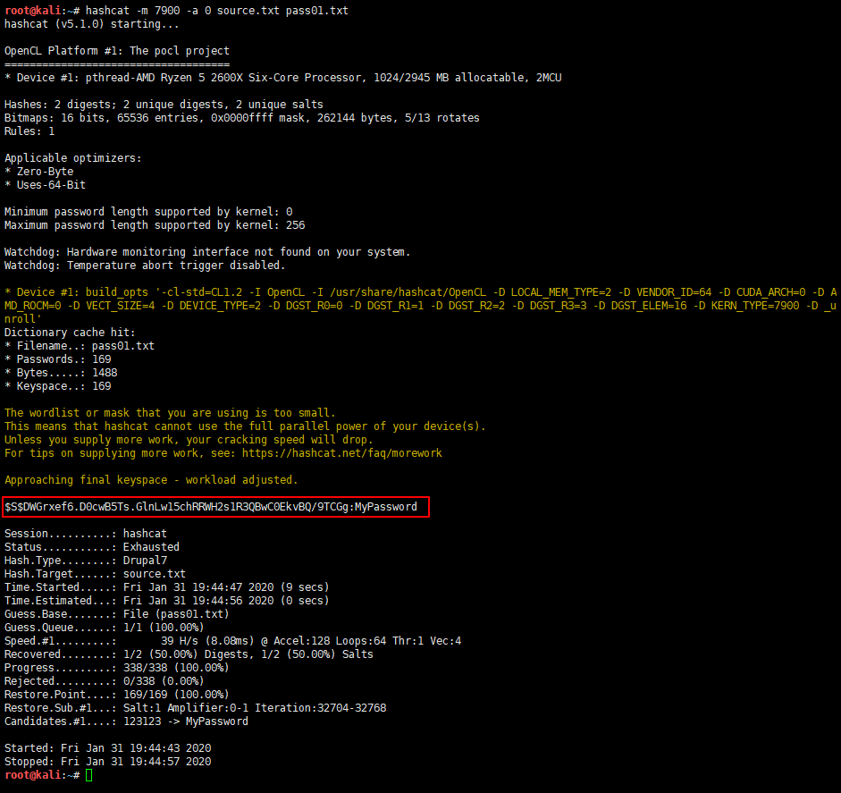

# Hashcat

<p align="center">
    
</p>

---

## 免责声明

`本文档仅供学习和研究使用,请勿使用文中的技术源码用于非法用途,任何人造成的任何负面影响,与本人无关.`

---

**简介**

Hashcat 自称是世界上最快的密码恢复工具。它在2015年之前拥有专有代码库，但现在作为免费软件发布。适用于 Linux，OS X 和 Windows 的版本可以使用基于 CPU 或基于 GPU 的变体。支持 hashcat 的散列算法有 Microsoft LM hash，MD4，MD5，SHA 系列，Unix 加密格式，MySQL 和 Cisco PIX 等。

**官网**
- https://hashcat.net/hashcat/

**文章 & Reference**
- [Hashcat的使用手册总结](https://xz.aliyun.com/t/4008)

**工具**
- [nccgroup/hashcrack](https://github.com/nccgroup/hashcrack) - 解包一些散列类型，选择合理的选项并调用 hashcat,hashcat 辅助工具
- [brannondorsey/naive-hashcat](https://github.com/brannondorsey/naive-hashcat) - 包括各种字典，组合，基于规则的攻击和掩码（暴力）攻击。hashcat 傻瓜版?
- [wavestone-cdt/wavecrack](https://github.com/wavestone-cdt/wavecrack) - web 版的 hashcat

---

# Hash id 对照表
```bash
hashcat --help

- [ Hash modes ] -

      # | Name                                             | Category
  ======+==================================================+======================================
    900 | MD4                                              | Raw Hash
      0 | MD5                                              | Raw Hash
   5100 | Half MD5                                         | Raw Hash
    100 | SHA1                                             | Raw Hash
   1300 | SHA2-224                                         | Raw Hash
   1400 | SHA2-256                                         | Raw Hash
  10800 | SHA2-384                                         | Raw Hash
   1700 | SHA2-512                                         | Raw Hash
  17300 | SHA3-224                                         | Raw Hash
  17400 | SHA3-256                                         | Raw Hash
  17500 | SHA3-384                                         | Raw Hash
  17600 | SHA3-512                                         | Raw Hash
  17700 | Keccak-224                                       | Raw Hash
  17800 | Keccak-256                                       | Raw Hash
  17900 | Keccak-384                                       | Raw Hash
  18000 | Keccak-512                                       | Raw Hash
    600 | BLAKE2b-512                                      | Raw Hash
  10100 | SipHash                                          | Raw Hash
   6000 | RIPEMD-160                                       | Raw Hash
   6100 | Whirlpool                                        | Raw Hash
   6900 | GOST R 34.11-94                                  | Raw Hash
  11700 | GOST R 34.11-2012 (Streebog) 256-bit, big-endian | Raw Hash
  11800 | GOST R 34.11-2012 (Streebog) 512-bit, big-endian | Raw Hash
     10 | md5($pass.$salt)                                 | Raw Hash, Salted and/or Iterated
     20 | md5($salt.$pass)                                 | Raw Hash, Salted and/or Iterated
     30 | md5(utf16le($pass).$salt)                        | Raw Hash, Salted and/or Iterated
     40 | md5($salt.utf16le($pass))                        | Raw Hash, Salted and/or Iterated
   3800 | md5($salt.$pass.$salt)                           | Raw Hash, Salted and/or Iterated
   3710 | md5($salt.md5($pass))                            | Raw Hash, Salted and/or Iterated
   4010 | md5($salt.md5($salt.$pass))                      | Raw Hash, Salted and/or Iterated
   4110 | md5($salt.md5($pass.$salt))                      | Raw Hash, Salted and/or Iterated
   2600 | md5(md5($pass))                                  | Raw Hash, Salted and/or Iterated
   3910 | md5(md5($pass).md5($salt))                       | Raw Hash, Salted and/or Iterated
   4300 | md5(strtoupper(md5($pass)))                      | Raw Hash, Salted and/or Iterated
   4400 | md5(sha1($pass))                                 | Raw Hash, Salted and/or Iterated
    110 | sha1($pass.$salt)                                | Raw Hash, Salted and/or Iterated
    120 | sha1($salt.$pass)                                | Raw Hash, Salted and/or Iterated
    130 | sha1(utf16le($pass).$salt)                       | Raw Hash, Salted and/or Iterated

以下略
```

---

# 例子

**查看爆破案例**
```bash
hashcat --example-hashes | less
```

**爆破 drupal 7 的密码 hash**
```bash

echo "\$S\$DvQI6Y600iNeXRIeEMF94Y6FvN8nujJcEDTCP9nS5.i38jnEKuDR" > source.txt
echo "\$S\$DWGrxef6.D0cwB5Ts.GlnLw15chRRWH2s1R3QBwC0EkvBQ/9TCGg" >> source.txt

hashcat -m 7900 -a 0 source.txt pass01.txt

-m 指定要破解的 hash 类型，如果不指定类型，则默认是 MD5
-a 指定要使用的破解模式，其值参考后面对参数。“-a 0”字典攻击，“-a 1” 组合攻击；“-a 3”掩码攻击。
source.txt 你要爆破的 hash 列表
pass01.txt 你的密码表
```



**爆破wifi握手包**
```bash
hashcat -m 2500 wireless.hccapx pass.txt --force
```

**爆破 NTLM-hash**
```bash
hashcat -m 1000 hash.txt pass1.txt
```

**爆破 net-NTLMv2**
```bash
hashcat -m 5600 hash.txt pass1.txt
```
